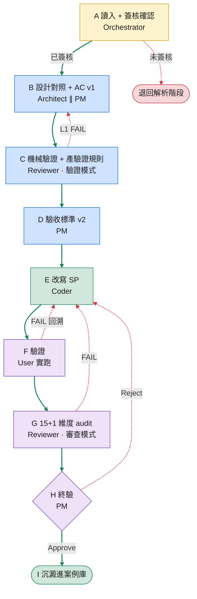

# 9-Phase Multi-Agent Workflow | 九階段多 Agent 工序鏈

> 規劃 → 設計 → 撰寫 → 審查 → 驗證的多 Agent 角色分工工序鏈。
> A pipeline that splits legacy-rewrite work across independent AI roles — the author and the auditor are never the same agent.

## Why Multi-Agent | 為什麼要多 Agent

一個 AI 如果又當作者、又當審查者，很容易掉進「自己檢查自己」的盲點——它會傾向相信自己剛寫出來的東西，看不到自己漏了什麼。

改寫 legacy 系統最危險的，往往不是那種一眼看得出的錯，而是**悄悄漏掉**一段原邏輯：少一個 WHERE 條件、少一個邊界判斷。程式照樣跑、報表照樣出，要等到月結對不上帳才發現——那時候要追是哪一行，已經很難了。

這套框架的做法是**把角色分開、各做各的**：拆成獨立的 agent，「寫」跟「審」交給不同角色，而且**誰都不能去改別人的產出**。

- 改寫的人（Coder）拿到的是已經鎖定的設計，不能回頭改設計來遷就自己的程式。
- 審查的人（Reviewer）只看不改，發現問題就退回上一關，不會「順手幫作者修掉」。
- 設計（Architect）、驗收（PM）、審查（Reviewer）各自獨立，疊成好幾道彼此不連坐的關卡。

代價是流程比較重、角色之間交接要嚴謹；換來的是**錯誤在進到下一關之前就被擋下來**，不會一路累積到最後一次才爆。

> 這不是「找一堆 AI 來投票」，而是「分工 + 交接紀律」。重點不在 agent 有幾個，而在沒有人能一邊當運動員、一邊當裁判。

## The 9 Phases | 九階段

每一關都有明確的**輸入、負責角色、產出**。下一關只吃上一關的產出，不回頭重議已經鎖定的決定。

> 實線綠＝happy path；虛線紅＝閘門擋下或失敗回溯。**每一條往回的紅線，都是「錯誤在這一關被擋下、退回對應角色重做」**——那正是這套流程相對「AI 一次生成」的價值所在。
> 配色：🟡 讀入閘門 ｜ 🔵 設計與規則 ｜ 🟢 改寫／結案 ｜ 🟣 驗證 ｜ 🔴 退回／回溯。

| Phase | 角色 | 職責 | 產出 |
|-------|------|------|------|
| **A** 讀入 + 簽核確認 | Orchestrator | 讀入上游解析結果，確認人工簽核完成；**未簽核就擋下、退回解析階段** | — (gate) |
| **B** 設計對照 + 驗收標準 v1 | Architect ∥ PM | Architect 逐單元建立「原始邏輯 ↔ 改寫後」對照表（每個邏輯單元都要對到，雙向標出「漏抄」與「來源不明」，狀態用固定列舉、不准自創）；PM 同時寫業務驗收標準 v1 | 設計對照表 + AC v1 |
| **C** 機械驗證 + 規則產生 | Orchestrator + Reviewer〔驗證模式〕 | L1 機械檢查對照表（狀態列舉合法、行號真實存在、片段確實重疊）；L2 由 Reviewer 產出一組 SQL 斷言規則 | 驗證規則 (SQL asserts) |
| **D** 驗收標準 v2 | PM | 把對照表 + 驗證規則收斂成**可判定**的 AC v2：規則↔AC 映射、PASS／FAIL／待裁定準則、**失敗回溯判定樹**、完工條件清單 | AC v2 |
| **E** 改寫 | Coder | 依鎖定的設計改寫：條件逐條對原文、來源／目標語言語義切分；產出落在隔離區，**絕不動 production** | 改寫後程式 (patched) |
| **F** 驗證 | User 實跑 | 分層驗證：跑得起來 → 邏輯規則全綠 → 筆數 1:1、累計差在容許值內。無法實測者標 `UNTESTED`，不算完工 | 驗證報告 |
| **G** 品質審查 | Reviewer〔審查模式〕 | 跑 15+1 維度 audit（NULL／型別／JOIN／效能／安全…），範圍限改寫區段，不重複 C 的對齊驗證 | Audit 報告 |
| **H** 終驗 | PM | 逐條打勾完工條件、確認三層關卡都過、列出未解決事項，最終 **Approve／Reject** | 終驗報告 |
| **I** 沉澱 | Orchestrator | 抽教訓、評估是否值得進案例庫、歸檔——讓下一案更快 | 教訓 + 案例索引 |

> `∥` = 並行，其餘為序列。**Orchestrator**（主控）＝持有整條流程、負責調度與交接的協調者，不替任何角色做專業判斷。

### 四個讓它不只是「叫 AI 跑一遍」的機制

1. **產出鎖定（read-only handoff）** — 上一關交出來的東西一旦交付就鎖成唯讀，下一關不能偷偷改。這會逼出真正的「退回重做」，而不是「下游默默把上游的錯修掉」——這樣責任歸屬才清楚。
2. **失敗回溯判定樹** — 哪一條驗證沒過，就退回對應的 Phase／角色，照規則走，而不是每次重新吵一輪。
3. **`UNTESTED` 是合法狀態** — 環境沒辦法實測時（比如資料還沒就緒），就老實標「預期會過、待驗」，但**不准當成已完成**。不靠樂觀心態收尾。
4. **機器查核才是底線，不是 AI 互相信任** — L1（驗 AI 引用的行號真的存在、片段和程式碼 token 重疊 ≥ 0.3，**這步不靠 AI**）加上 V0.5（**會真的執行、回傳違規筆數的 SQL 斷言**）是硬閘；AI 的判斷只疊在這兩層硬驗上面，不會取代它們。這是擋「AI 編造假證據」和「AI 自己跟自己互搏」的根本防線。

## Role Separation | 角色分工心法

| 角色 | 能做 | 不能做 |
|------|------|--------|
| **Architect** 設計 | 讀原始碼、建對照、判定差異 | 不寫最終程式 |
| **PM** 驗收 | 定義業務驗收標準、終驗打勾 | 不寫程式、不改設計 |
| **Coder** 改寫 | 依鎖定設計寫程式、自測 | 不能回改設計來遷就自己 |
| **Reviewer** 審查 | 只讀；產驗證規則／跑 audit；發現問題退回 | 不能替作者改程式 |
| **Orchestrator** 主控 | 調度、交接、上鎖、落檔 | 不替任何角色做專業判斷 |

一句話：**沒有任何一個角色能同時「做」又「驗自己做的」。** 這是整套框架對抗「AI 自我感覺良好」的核心設計。

---

> 本文件描述方法論本身。具體案例的表名、欄位、行號均已去敏化；驗證數據見 [README → Proof](../README.md#proof--實證數據)。
